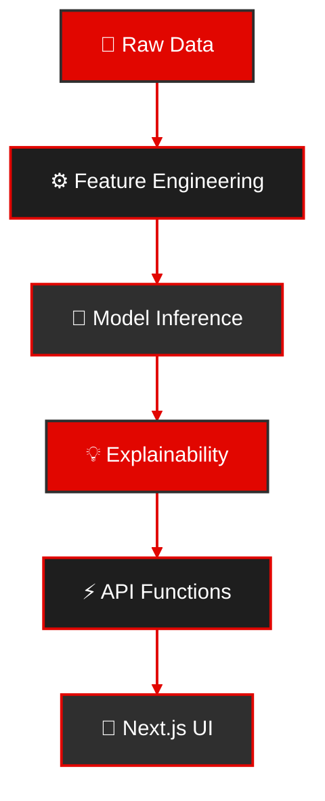

# 🏎️ F1 Agent — Race Predictor & Explainable Insights

<div align="center">

[](https://f1-agent.vercel.app)
[](https://f1-agent.vercel.app)
[](https://f1-agent.vercel.app)

[Live Demo](https://f1-agent.vercel.app) • [Documentation](#architecture) • [Quick Start](#local-development)

**Last Updated:** Aug 13, 2025
</div>

Predicts F1 race outcomes from recent form, quali pace, tyre/strategy signals, and track history — then explains *why* with feature attributions and natural‑language rationales.

## ⚡ Tech Stack

<table>
<tr>
<td>
  
### 🎨 Frontend


</td>
<td>

### 🤖 Data/ML


</td>
<td>

### ☁️ Infrastructure


</td>
</tr>
</table>

## 🏗️ Architecture


- **Feature Engineering:** aggregates last N races, team/driver deltas, track-specific coefficients, weather proxies (if present).
- **Models:** start with simple baselines (logistic/GBM) then iterate; keep model cards in `/models` to document choices.
- **Explainability:** SHAP-like or permutation-attribution summaries → rendered as bar charts and natural-language notes.

## 🚀 Quick Start

<details>
<summary>💻 Frontend Setup</summary>

```bash
# Enable pnpm
corepack enable

# Install dependencies and start dev server
pnpm i && pnpm --filter web dev
```
</details>

<details>
<summary>🐍 Python Environment Setup</summary>

```bash
# Create and activate virtual environment
python -m venv .venv && source .venv/bin/activate

# Install dependencies
pip install -r requirements.txt

# Run tests
pytest -q
```
</details>

## Example: Explainability Output
```json
{
  "race_id": "demo-001",
  "prediction": { "driver": "VER", "p_win": 0.42, "p_podium": 0.78 },
  "top_features": [
    { "feature": "quali_delta", "value": -0.18, "attribution": 0.34 },
    { "feature": "long_run_pace", "value": 0.27, "attribution": 0.21 },
    { "feature": "track_history_driver", "value": 0.31, "attribution": 0.17 },
    { "feature": "pit_stop_efficiency_team", "value": 0.09, "attribution": 0.11 }
  ],
  "notes": [
    "Qualifying pace relative to field strongly favors the prediction.",
    "Long-run pace in FP sessions is a secondary contributor.",
    "Driver's past results at this circuit add confidence."
  ]
}
```
> The UI renders these attributions as a chart plus a short paragraph explaining impact and direction.

## 📊 Datasets
<details>
<summary>Data Organization</summary>

- 📁 Raw data (CSV/Parquet) → `/data/raw`
- 📊 Processed features → `/data/processed` (gitignored)
- 📝 Documentation → `/data/DATASET.md` (provenance & limitations)
</details>

## 🧪 Testing
<details>
<summary>Test Suite Details</summary>

- ✅ Unit tests for feature builders (`tests/feature_builders_test.py`)
- 🔄 Integration tests with minimal fixtures
- 📈 Coverage reports in CI pipeline
</details>

## 🔄 CI/CD
[](https://github.com/prateekmulye/f1-agent/actions)

Automated workflows in `.github/workflows/ci.yml`:
- 🛠️ Build validation
- 🧪 Test execution
- 📊 Code coverage
- 🚀 Deployment checks

## 🗺️ Roadmap
- [ ] 🎯 Per-track feature weights
- [ ] ⚡ Strategy simulation (pit windows & tyre compounds)
- [ ] 📝 Model cards + dataset datasheet
- [ ] 🔄 Export JSON for downstream agents

## 📄 License
[](LICENSE)
