# 🏎️ F1 Agent — Race Predictor & Explainable Insights

<div align="center">

[](https://f1-agent.vercel.app)
[](https://f1-agent.vercel.app)
[](https://f1-agent.vercel.app)

[Live Demo](https://f1-agent.vercel.app) • [Architecture](#-architecture) • [Quick Start](#-quick-start)

**Last Updated:** Aug 16, 2025
</div>

Predicts F1 race outcomes from recent form, quali pace, tyre/strategy signals, and track history — then explains *why* with feature attributions and natural‑language rationales.

## ⚡ Tech Stack

<table>
<tr>
<td>
  
### 🎨 Frontend


</td>
<td>

### 🤖 Data/ML

Lightweight logistic baseline and utilities in `scripts/`.
</td>
<td>

### ☁️ Infrastructure


</td>
</tr>
</table>

## 🏗️ Architecture

```mermaid
graph TD
  A[🏁 Raw Data] --> B[⚙️ Feature Engineering]
  B --> C[� Baseline Scoring]
  C --> D[⚡ API Functions]
  D --> E[🎨 Next.js UI]
    
    style A fill:#E10600,stroke:#2F2F2F,stroke-width:2px,color:#FFFFFF
    style B fill:#1E1E1E,stroke:#E10600,stroke-width:2px,color:#FFFFFF
  style C fill:#2F2F2F,stroke:#E10600,stroke-width:2px,color:#FFFFFF
  style D fill:#1E1E1E,stroke:#E10600,stroke-width:2px,color:#FFFFFF
  style E fill:#2F2F2F,stroke:#E10600,stroke-width:2px,color:#FFFFFF
    
    linkStyle default stroke:#E10600,stroke-width:2px
```


- Feature engineering: aggregates last N races, team/driver deltas, track-specific effects, weather proxies (if present).
- Baseline model: logistic with coefficients stored in Postgres or JSON.
- UI: Next.js App Router, streaming chat, Tailwind v4 layer utilities.

## 🚀 Quick Start

```bash
corepack enable
pnpm i
pnpm --filter web dev
```

Environment variables:
- NEON_DATABASE_URL (optional; required for evals/seeding)
- GROQ_API_KEY (optional; for agent answers via Groq LLM)

## Agent & Evals

- Agent API: `/api/agent` uses Groq (Llama 3.1) with two tools: `get_prediction`, `run_eval`.
- Input normalization: free-form names like “Lando Norris” → `NOR`, “British GP 2024” → `2024_gbr`.
- Evals API: `/api/evals/run` shells out to `scripts/run_eval.ts`.
  - Dev: runs via tsx from repo root; requires `NEON_DATABASE_URL`.
  - Prod/serverless: falls back to node; if process spawn is blocked, returns diagnostics.

## 📊 Datasets
- `data/historical_features.csv` for training/evals
- `data/model.json` for seed coefficients

## 🧪 Testing
This project currently focuses on end-to-end behavior. Add unit/integration tests as you evolve the model and UI.

## 🔄 CI/CD
Build and deploy via Vercel and pnpm workspaces. Add a CI workflow when tests land.

## 🔮 Future work
- Per-track and per-session feature weights
- Live data ingestion (OpenF1) for FP/Quali deltas
- Model cards and dataset documentation
- Background job for evals (no child_process), plus tracing
- Richer attributions with visual breakdowns per driver

## 📄 License
[](LICENSE)
